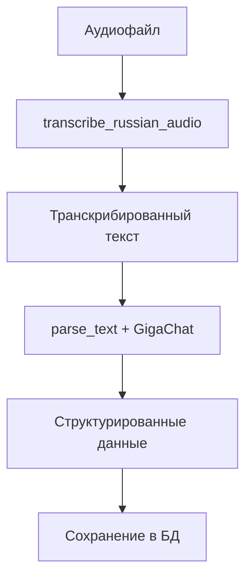

# Обработка аудио - Endpoint `/v1/animals/audio/process`

## Обзор

Обновленный endpoint `/v1/animals/audio/process` теперь поддерживает полную обработку голосовых сообщений:

1. **Транскрипция аудио** - преобразование русской речи в текст с помощью модели Wav2Vec2
2. **Анализ текста** - извлечение структурированных данных с помощью GigaChat
3. **Сохранение в базу данных** - автоматическое сохранение результатов анализа

## Процесс обработки



## Извлекаемые данные

Система автоматически извлекает из голосового сообщения:

### 1. Поведение/состояние животного
- Описание текущего поведения
- Исторические данные о состоянии
- Активность и настроение

### 2. Измерения животного
- Вес (в кг)
- Температура тела (в градусах)
- Рост/высота
- Другие физические параметры

### 3. Детали кормления
- Тип пищи
- Количество корма
- Время кормления
- Описание аппетита

### 4. Взаимоотношения с другими животными
- Взаимодействия с другими особями
- Социальное поведение
- Доминантность/подчиненность
- Конфликты (если есть)

## API Использование

### Запрос

```http
POST /v1/animals/audio/process
Content-Type: multipart/form-data

Parameters:
- audio_file: файл (обязательный) - аудиофайл для обработки
- animal_id: integer (обязательный) - ID животного
- description: string (опциональный) - дополнительное описание
```

### Ответ

```json
{
  "exception": 0,
  "data": {
    "transcription_id": 123,
    "animal_id": 456,
    "processing_status": "completed",
    "transcribed_text": "Корова Мурка сегодня весит 450 кг...",
    "analysis_results": {
      "processing_method": "Audio Transcription + GigaChat Analysis",
      "confidence_score": 0.85,
      "raw_analysis": {
        "behavior_state": "Спокойное, жует жвачку",
        "measurements": {
          "weight": "450 кг",
          "temperature": "38.5°C"
        },
        "feeding_details": {
          "food_type": "сено, комбикорм",
          "quantity": "15 кг сена, 5 кг комбикорма"
        },
        "relationships": {
          "interactions": "дружелюбно с другими коровами"
        }
      }
    },
    "created_at": "2024-01-15T10:30:00Z"
  }
}
```

## Поддерживаемые форматы аудио

- WAV
- MP3
- MP4
- M4A
- OGG
- FLAC

## Технические детали

### Модель транскрипции
- **Модель**: `bond005/wav2vec2-large-ru-golos`
- **Язык**: Русский
- **Частота дискретизации**: 16 kHz
- **Каналы**: Автоматическое преобразование в моно

### Анализ текста
- **AI Модель**: GigaChat
- **Формат вывода**: Структурированный JSON
- **Обработка ошибок**: Автоматический fallback на значения по умолчанию

## Примеры использования

### cURL
```bash
curl -X POST "http://localhost:8000/v1/animals/audio/process" \
  -F "audio_file=@recording.wav" \
  -F "animal_id=123" \
  -F "description=Утреннее наблюдение за коровой"
```

### Python requests
```python
import requests

with open("recording.wav", "rb") as audio_file:
    response = requests.post(
        "http://localhost:8000/v1/animals/audio/process",
        files={"audio_file": audio_file},
        data={
            "animal_id": 123,
            "description": "Утреннее наблюдение за коровой"
        }
    )
    
result = response.json()
```

## Обработка ошибок

Система обрабатывает следующие типы ошибок:

1. **Ошибки транскрипции** - использует описание как fallback
2. **Ошибки анализа GigaChat** - возвращает данные по умолчанию
3. **Ошибки файла** - валидация формата и размера
4. **Ошибки БД** - откат транзакции

## Логирование

Все этапы обработки логируются:
- Начало транскрипции
- Результат транскрипции
- Начало анализа GigaChat
- Сохранение в базу данных
- Ошибки на каждом этапе
